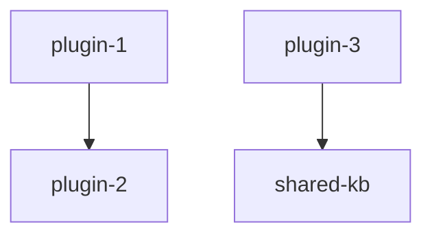
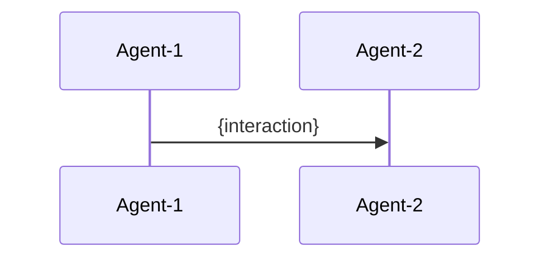

# Generate Agent-Plugin Mapping

## Overview

The agent-plugin mapping document bridges the business view (agents organized by function) with the technical view (plugins organized by implementation). It provides a complete traceability matrix from agents → plugins → skills and highlights cross-domain collaboration flows. This is Step 2 of the platform documentation pipeline.

## Inputs Required

1. **Brainmap documents** (generated by `generate-brainmap`):
   - `brainmap-index.md` — master index with all agents
   - `brainmap-module-*.md` — per-module agent details
2. **Domain workspace** (`studio/changes/{domain}/`):
   - `domain-map.md` — plugin candidates and architecture
3. **Plugin workspaces** (`studio/changes/{plugin-name}/`):
   - `skill-map.md` — skill breakdown
   - `brief.md` — business context
4. **Implementation files** (target directories):
   - `skills/*/SKILL.md` — actual skill implementations
5. **Platform configuration**:
   - Platform name, industry, collection structure (single vs. multiple plugin collections)

## Workflow

### Step 1: Read All Sources

- Read brainmap-index.md for agent definitions
- Read all brainmap-module-*.md for detailed agent-skill associations
- Read domain-map.md for plugin architecture
- Read all skill-map.md files for skill definitions
- Identify collections (groups of plugins, e.g., "core plugins" + "workshop plugins")

### Step 2: Build Architecture Diagram

Create an ASCII architecture diagram showing:

```
┌─────────────────────────────────────────────────────┐
│              {platform_name} 平台                    │
├──────────────┬──────────────┬───────────────────────┤
│   G端(政府)   │   B端(机构)   │      C端(家庭)        │
├──────────────┴──────────────┴───────────────────────┤
│            {N} 个角色智能体层                         │
├─────────────────────────────────────────────────────┤
│       Plugin Collection 1: {name} ({n} plugins)     │
│  ┌──────┐ ┌──────┐ ┌──────┐ ┌──────┐              │
│  │plug-1│ │plug-2│ │plug-3│ │plug-4│ ...           │
│  │{n}sk │ │{n}sk │ │{n}sk │ │{n}sk │              │
│  └──────┘ └──────┘ └──────┘ └──────┘              │
├─────────────────────────────────────────────────────┤
│       Plugin Collection 2: {name} ({n} plugins)     │
│  (if applicable)                                     │
├─────────────────────────────────────────────────────┤
│  Knowledge Graph │ RAG System │ ML Models │ DW      │
└─────────────────────────────────────────────────────┘
```

- Replace `{platform_name}` with the actual platform name from configuration
- User segments (G端/B端/C端) should reflect the actual user segments from brainmap
- Each plugin box shows the plugin name and skill count
- Infrastructure layer reflects actual technical dependencies from domain-map.md

### Step 3: Generate Module-Plugin Mapping Matrix

For each module from brainmap, produce a mapping table:

```markdown
### 模块{N}：{module_name}

| 智能体 | 关联 Plugin | 技能列表 | 能力标签 |
|--------|-----------|---------|---------|
| #{num} {agent_name} | {plugin} | {skill1}, {skill2}, ... | {tags} |
```

- Agent numbers (`#{num}`) must match brainmap-index.md exactly
- Plugin names must match domain-map.md / skill-map.md
- Skills listed must exist in the corresponding skill-map.md
- Capability tags summarize agent abilities (e.g., `数据分析`, `报告生成`, `IoT接入`)

### Step 4: Generate Coverage Analysis

Create a comprehensive coverage table:

```markdown
## 覆盖率分析

### Plugin × 智能体 覆盖矩阵

| Plugin | Skills | Agents | Primary Module | Coverage |
|--------|:------:|:------:|---------------|----------|
| {plugin} | {n} | {n} | {module} | %)
- 独立技能(无智能体直接关联): {uncovered}
```

- Coverage percentage = skills with at least one associated agent / total skills
- List uncovered skills explicitly so they can be reviewed

### Step 5: Generate Dependency Topology

Show plugin dependencies using Mermaid:



- Extract dependencies from plugin.json.draft files and skill-map.md cross-references
- Highlight shared knowledge bases or data stores
- Mark dependency direction (depends-on vs. consumed-by)

### Step 6: Generate Feature Matrix

Cross-reference plugins with platform features:

```markdown
## 功能特性矩阵

| Plugin | IoT数据 | 知识图谱 | ML推理 | RAG检索 | 报告生成 | 家长端 | 管理端 |
|--------|:------:|:------:|:-----:|:------:|:------:|:-----:|:-----:|
| {name} | ✓/— | ✓/— | ... | ... | ... | ... | ... |
```

- Feature columns should be derived from actual platform capabilities, not hardcoded
- Use `✓` for supported, `—` for not applicable
- Add footnotes for partial or planned support

### Step 7: Generate Cross-Domain Flows

Describe 4–6 key business flows that cross module/plugin boundaries:

```markdown
## 跨域协同流程

### 流程1: {flow_name}
**触发**: {trigger_event}
**参与智能体**: #{n1} → #{n2} → #{n3}
**数据流**: {data_flow_description}
```

Include Mermaid sequence diagrams for each flow:



- Select flows that demonstrate cross-module collaboration
- Reference agent numbers consistently with brainmap
- Describe data transformations at each step

### Step 8: Generate Implementation Priority

Rank plugins by implementation priority based on:
- Business impact (from opportunity-brief if available)
- Technical complexity
- Dependency order (plugins with no dependencies first)
- Data readiness

```markdown
## 实施优先级

| 优先级 | Plugin | 理由 | 前置依赖 | 预计复杂度 |
|:------:|--------|------|---------|:--------:|
| P0 | {name} | {reason} | — | ⭐⭐⭐ |
| P1 | {name} | {reason} | {deps} | ⭐⭐ |
```

- P0 = must-have for MVP
- P1 = high value, build after P0
- P2 = important but can wait
- P3 = nice-to-have / future phase

## Output

Write the final document to `{output_dir}/agent-plugin-mapping.md`.

The output directory is determined by the platform documentation configuration — typically alongside the brainmap documents in the designated docs output folder.

## Quality Checks

1. Every agent from brainmap-index.md appears in the mapping
2. Every plugin from domain-map.md appears in the mapping
3. Every skill from every skill-map.md is referenced at least once
4. Cross-domain flows reference valid agent numbers
5. Architecture diagram totals match actual counts
6. Mermaid diagrams render without errors
7. No orphan references — all agent numbers, plugin names, and skill names resolve to real entities

## Does NOT

- Define new agents (that's generate-brainmap's job)
- Design new skills or plugins (that's the planning pipeline)
- Generate technical design documents
